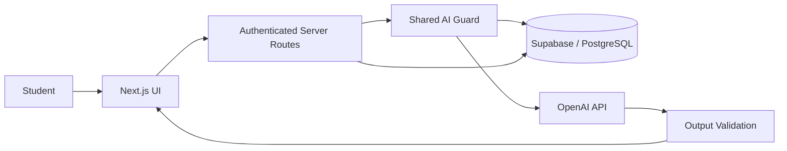
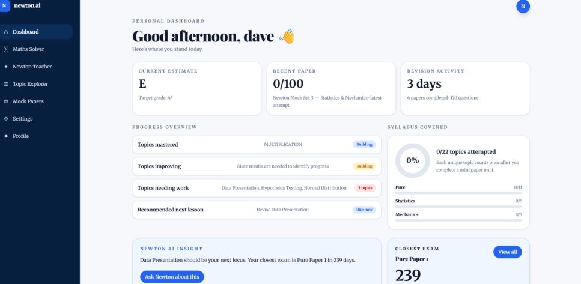
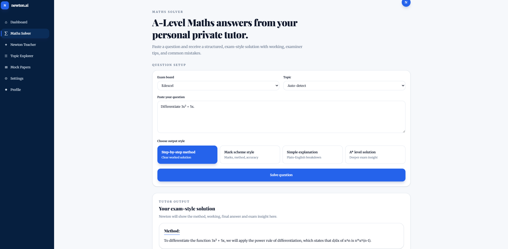
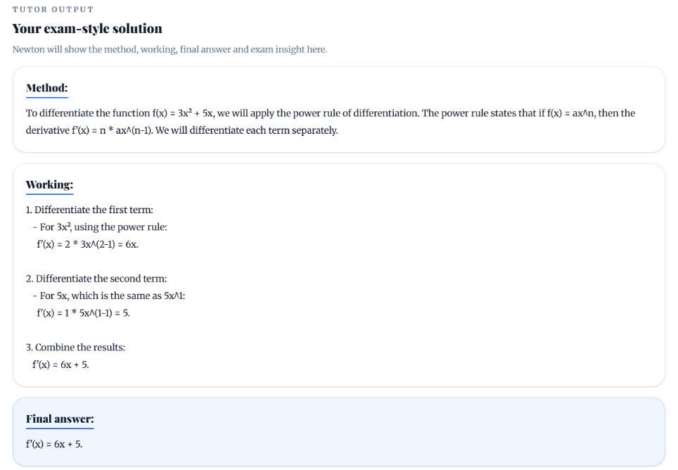
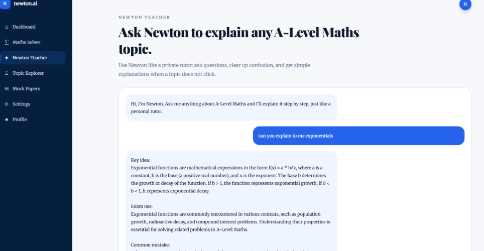
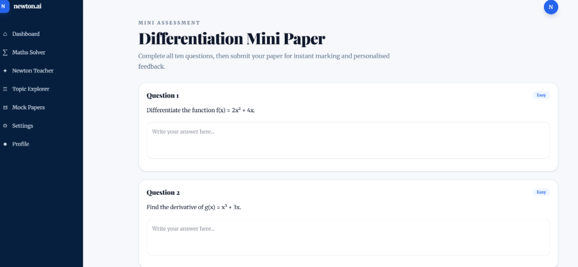
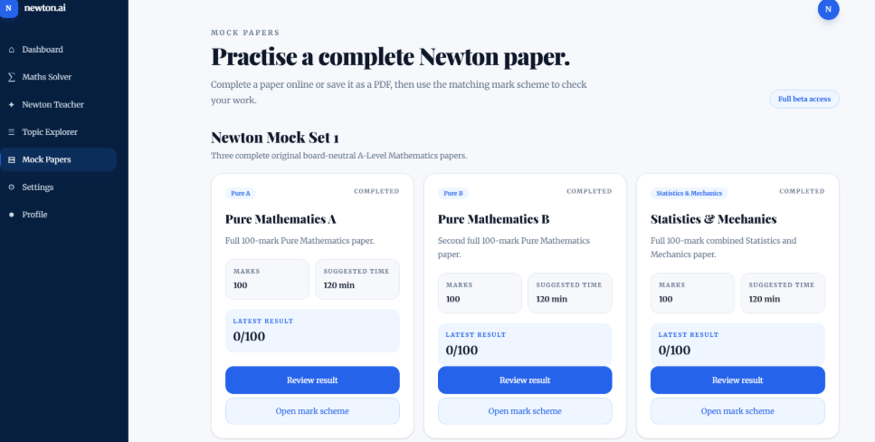
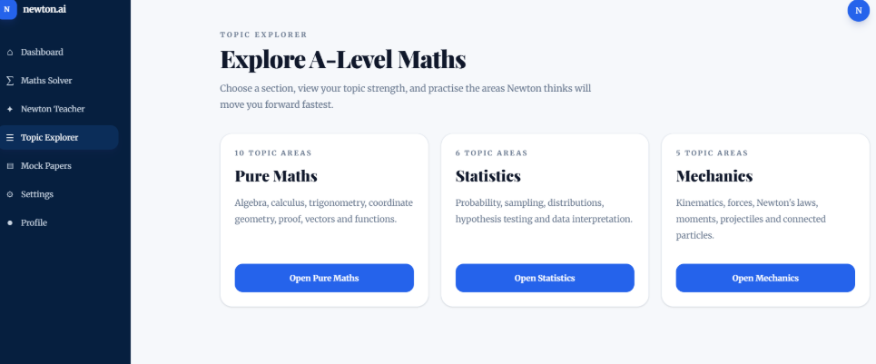

# Newton.ai

Newton.ai is an AI-powered A-Level Mathematics platform designed to support students with worked solutions, explanations, automated marking, personalised feedback, generated assessments, and mock-paper practice.

> This is a public showcase repository. The production application, private source code, credentials, database configuration, and security-sensitive implementation details are intentionally not included.

## What Newton.ai does

- Generates step-by-step A-Level Maths solutions
- Explains difficult steps in clearer language
- Produces similar questions for targeted practice
- Marks student answers and gives feedback
- Generates topic-based mini assessments
- Supports mock-paper workflows with results and mark schemes
- Uses exam-board-aware prompting and validation
- Newton.ai learns a students strengths and weaknesses, devises guided revsion strategies based on their abilities, exam dates and tracks the amount of the sylubus a student has covered
- Newton behaves as a personal tutor with recomendations on daily lessons, what to focus on, encouragement and advice 

## Technology

- **Frontend:** React, Next.js, TypeScript, Tailwind CSS
- **Backend:** Next.js server routes
- **Database & Auth:** Supabase / PostgreSQL
- **AI:** OpenAI API
- **Security:** authentication, Row Level Security, object-level authorisation, input validation, server-side secret handling, rate limiting, concurrency controls, safe error handling, and AI output validation

## Engineering highlights

### AI workflow design

Newton.ai separates AI routes by responsibility rather than relying on one large general-purpose endpoint. Individual routes handle solving, explaining, similar-question generation, answer marking, assessment generation, and assessment marking.

This makes validation, testing, rate limiting, and failure handling easier to reason about.

### Security-first architecture

Security work is treated as a launch gate rather than a final polish step. The application has been reviewed for:

- protected-route authentication
- object-level authorisation
- Supabase Row Level Security
- private-response cache controls
- safe error responses
- server-side secret handling
- request-size and content-type validation
- prompt-injection resistance
- AI output integrity checks
- per-user AI rate limiting
- daily AI usage quotas
- concurrent-request limits
- request-lease cleanup after success and failure

See [Security Engineering](docs/security.md) for a higher-level overview.

### Abuse and cost controls

AI requests pass through a shared server-side guard before reaching the model. The guard can enforce:

1. a short-window per-user/per-route request limit
2. a global daily request quota
3. a per-user concurrency limit
4. an expiring active-request lease
5. usage accounting after completion

This design prevents rejected requests from unnecessarily reaching the model and avoids leaving users locked out if an upstream request fails.

## Architecture

For more detail, see [Architecture](docs/architecture.md).

## Security testing

The application has been tested against cases including:

- unauthenticated access
- cross-account object access
- malformed and oversized request bodies
- unsupported content types
- copied/private URLs
- prompt-injection attempts
- AI output-format failures
- rate-limit exhaustion
- concurrent AI requests
- upstream AI failures
- lease cleanup and usage-accounting behaviour

See [Testing](docs/testing.md).

## Product showcase

### Personal dashboard

Newton.ai provides a personalised dashboard showing estimated performance, revision activity, syllabus coverage, weaker topics and recommended next steps.

### AI Maths Solver

Students can enter an A-Level Maths question, select an exam board and topic, and choose between different solution styles.

### Worked solutions and exam feedback

Newton.ai generates structured working, a final answer and exam-focused feedback including examiner insight, common mistakes and typical marks.

### Newton Teacher

Newton Teacher provides conversational explanations of A-Level Maths concepts, with supporting mathematical visualisations where useful.

### Generated mini assessments

Students can generate topic-specific ten-question mini papers for targeted practice and automated marking.

### Mock papers

Newton.ai includes complete mock-paper workflows with full papers, completion tracking, results and matching mark schemes.

### Topic Explorer

The Topic Explorer organises A-Level Mathematics across Pure Mathematics, Statistics and Mechanics for focused revision.

Avoid screenshots containing bearer tokens, API keys, email addresses, database IDs, private student data, or browser request headers.

## Repository scope

This repository is intended to demonstrate the product, architecture, and engineering decisions behind Newton.ai.

It deliberately excludes:

- production source code
- environment files
- API keys and credentials
- database secrets
- private deployment configuration
- student or tester data
- detailed exploit reproduction steps

## Project status

Newton.ai is under active development and security review ahead of wider external testing.

## Documentation

- [Architecture](docs/architecture.md)
- [Security Engineering](docs/security.md)
- [Testing](docs/testing.md)
- [Screenshot Guide](screenshots/README.md)
