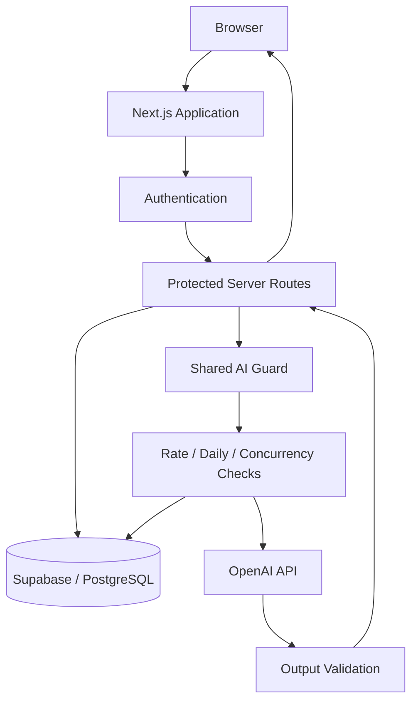

# Architecture

## Overview

Newton.ai uses a Next.js application with authenticated server routes, Supabase for authentication and PostgreSQL-backed data storage, and OpenAI for AI-assisted maths workflows.

The public repository intentionally describes the architecture at a high level without exposing production configuration or sensitive implementation details.

## Application flow

## Route separation

AI functionality is split across dedicated routes:

- solve
- explain
- similar-question generation
- single-answer marking
- assessment generation
- assessment marking

Each route has its own input validation and output-integrity requirements while sharing common authentication and AI-abuse controls.

## Data boundary

Student-specific data is protected at both the application and database layers.

The intended design combines:

- authenticated server access
- object-level authorisation
- Supabase Row Level Security
- server-only privileged credentials
- private caching behaviour for sensitive responses

## AI request guard

Before an eligible AI request reaches the model, a shared guard can enforce:

- per-user/per-route short-window limits
- a global daily quota
- a maximum number of active requests
- expiring request leases

After the model request finishes, token usage and success/failure status are recorded and the active lease is released.

## Failure behaviour

External model failures are handled with generic client-facing responses. Internal error details are retained only in server-side logs where appropriate.

The application is designed so that failure cleanup still runs after an upstream error, preventing stale request leases from blocking future requests.
